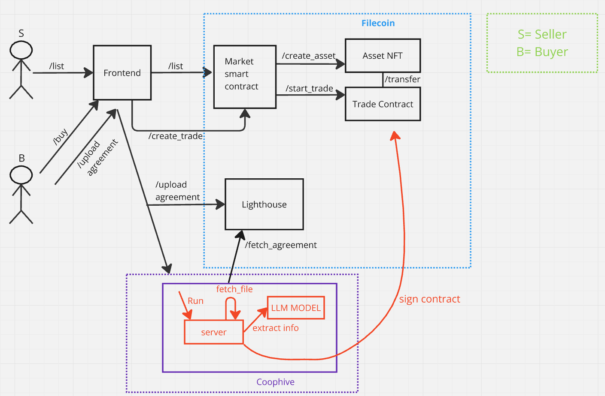

# NexArb - Real Estate Market

- A marketplace where sellers list their houses and upon listing an asset NFT is designed by our contracts, then when the buyer pays the price to our contract with a signed sales agreement, we verify it with our LLM models inside coop-hive and the asset ownership NFT is transferred to the buyer and the money to the seller. 

## Technologies Used

- **Smart Contracts**: Solidity & Filecoin
- **Decentralized Compute**: Coophive
- **Decentralized Storage**: Lighthouse Storage
- **Backend**: Python
- **Frontend**: Next.js

## How it works? 

 - A seller lists an apartment on the market, and an NFT is created for that asset. In this step, a trade contract is also generated. Then, a buyer requests to buy this apartment. The buyer transfers the coins to the trade contract. Then the buyer uploads the sales agreement and transaction hash. The verifier in coop-hive verifies all details like the correct transfer amount,  the buyer, and the seller by extracting this knowledge by reading this sales agreement via our LLM model. Then this verifier signs the trade contract. After the signature, the NFT is transferred to the buyer proving the ownership, and the coins held by the trade contract are transferred to the seller's wallet.